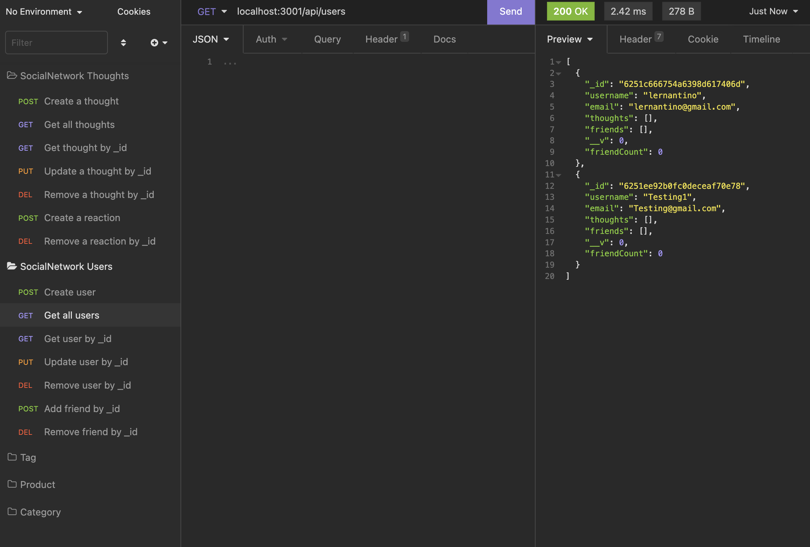
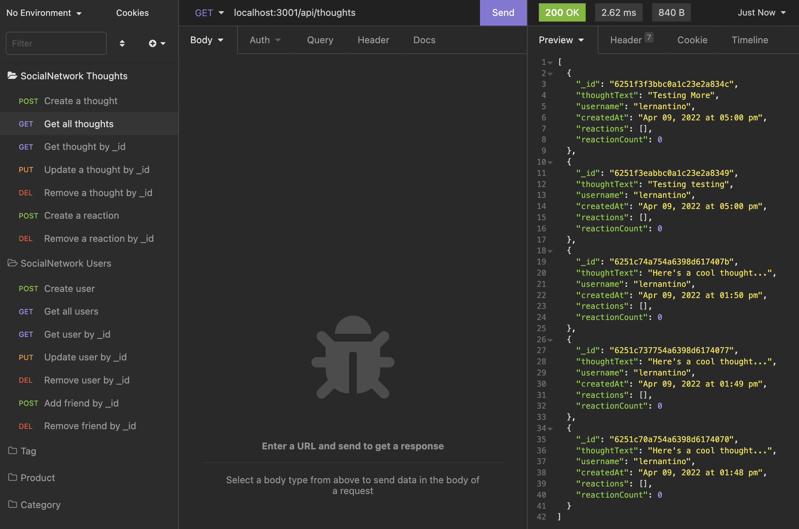

# NoSQL: Social-Network-API-with-MongoDB

[](https://opensource.org/licenses/MIT)

---

## Description

MongoDB is a popular choice for many social networks due to its speed with large amounts of data and flexibility with unstructured data.

This is an API for a social network web application where users can share their thoughts, react to friends’ thoughts, and create a friend list. Express.js, MongoDB, and the Mongoose ODM are used in this application.

No seed data is provided, so you’ll need to create your own data using Insomnia after you’ve created your API to try out this application.

---

## Table of Contents

- [Installation](##Installation)

- [Usage](##Usage)

- [License](##License)

- [Tests](##Tests)

- [Questions](##Questions)

---

## Installation

- First, use git clone in the terminal to download the project
- Then open the project in VS Code and enter the terminal by right clicking the package.json
- Within the terminal, use npm install install to install the all packages
- Open server in terminal by using npm start
- The routes can be tested by using Insomnia

### API Routes

**`/api/users`**

- `GET` all users

- `GET` a single user by its `_id` and populated thought and friend data

- `POST` a new user:

```json
// example data
{
  "username": "Alex",
  "email": "Alex@gmail.com"
}
```

- `PUT` to update a user by its `_id`

- `DELETE` to remove user by its `_id`

**BONUS**: Remove a user's associated thoughts when deleted.

---

**`/api/users/:userId/friends/:friendId`**

- `POST` to add a new friend to a user's friend list

- `DELETE` to remove a friend from a user's friend list

---

**`/api/thoughts`**

- `GET` to get all thoughts

- `GET` to get a single thought by its `_id`

- `POST` to create a new thought (don't forget to push the created thought's `_id` to the associated user's `thoughts` array field)

```json
// example data
{
  "thoughtText": "Here's a cool thought...",
  "username": "Alex",
  "userId": "5edff358a0fcb779aa7b118b"
}
```

- `PUT` to update a thought by its `_id`

- `DELETE` to remove a thought by its `_id`

---

**`/api/thoughts/:thoughtId/reactions`**

- `POST` to create a reaction stored in a single thought's `reactions` array field

- `DELETE` to pull and remove a reaction by the reaction's `reactionId` value

## Usage

For learning about NoSQL database (MongoDB)

### Screenshot:




### Walkthrough Video:

[![Watch the video here]](https://drive.google.com/file/d/1QTtUpXADpg4hcaVns7HmgPFpLEkFPRVQ/view?usp=sharing)

---

## License

https://opensource.org/licenses/MIT

---

## Tests

There are no tests for this application.

---

## Questions

If you have any questions or concerns please contact me at bxz5089@gmail.com or checkout my GitHub page at [bxz5089](https://github.com/bxz5089/).
